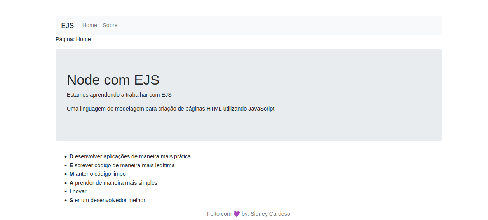

# Node e EJS

Este projeto desenvolvido nas aulas do Discover pela Rocketseat, tem o intuito de ensinar como podemos usar o template EJS para renderizarmos páginas HTML com o JavaScript

<h2>Este é o resultado final do projeto: </h2>
